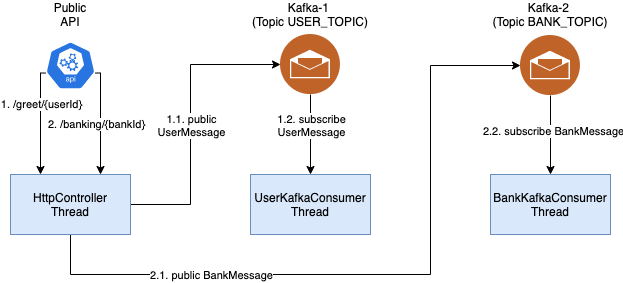

The example project for StringBoot service

<div align="center">
    
</div>

## Getting Started

## Project structure
```
.
├── spring-boot-kafka-multiple-brokers
│   ├── Dockerfile
│   ...
├── docker-compose.yaml
|
└── README.md
```

## Prerequisites
- Make sure that you have Docker and Docker Compose installed
  - Windows or macOS:
    [Install Docker Desktop](https://www.docker.com/get-started)
  - Linux: [Install Docker](https://www.docker.com/get-started) and then
    [Docker Compose](https://github.com/docker/compose)

## Start infrastructure

```shell script
$ docker-compose -f ./docker-compose-infrastructure.yml -p spring-boot-kafka-multiple-brokers-infrastructure up -d
```

## Start services
### Start services in local

- Build project
```shell script
$ ./mvnw clean package
$ cd spring-boot-kafka-multiple-brokers
$ ../mvnw spring-boot:run
...
```

### Start services in docker 

```shell script
$ docker-compose -f ./docker-compose-service.yml -p spring-boot-kafka-multiple-brokers-service up -d
```

## Run testing

- Send request /greet 
```shell script
curl -H "Content-Type: application/json" --request POST --data '{"message":"xyz"}' http://localhost:8081/greet/1
```

Application log

```text
2021-10-07 14:34:29.265  INFO 4485 --- [ad | producer-2] i.c.k.d.userkafka.UserKafkaProducerImpl  : Kafka sent message='{"user_id":1,"message":"xyz"}' with offset=1
2021-10-07 14:34:29.274  INFO 4485 --- [ntainer#1-0-C-1] i.c.k.e.kafka.UserKafkaConsumer          : Consumed - Partition: 0 - Offset: 1 - Value: {"user_id":1,"message":"xyz"}
2021-10-07 14:34:29.274  INFO 4485 --- [ntainer#1-0-C-1] i.c.k.core.usecase.user.UserUseCaseImpl  : Goodbye user 1 with message xyz
```

- Send request /banking

```shell script
curl -H "Content-Type: application/json" --request GET http://localhost:8081/banking/1
```

Application log

```text
2021-10-07 14:25:07.955  INFO 4485 --- [ntainer#0-0-C-1] i.c.k.e.kafka.BankKafkaConsumer          : Consumed - Partition: 0 - Offset: 1 - Value: {"bank_id":1}
2021-10-07 14:25:07.957  INFO 4485 --- [ntainer#0-0-C-1] i.c.k.core.usecase.bank.BankUseCaseImpl  : Process banking 1 
2021-10-07 14:25:07.986  INFO 4485 --- [ad | producer-1] i.c.k.d.bankkafka.BankKafkaProducerImpl  : Kafka sent message='{"bank_id":1}' with offset=1
```

## Stop project

- Kill project if start in local mode
- Stop infrastructure & services in docker

```shell script
$ docker-compose -f ./docker-compose-infrastructure.yml -p spring-boot-infrastructure down
$ docker-compose -f ./docker-compose-service.yml -p spring-boot-service down
```

## Contribute

## Reference

- https://www.baeldung.com/ops/kafka-docker-setup
- https://docs.spring.io/spring-kafka/reference/html/#spring-boot-consumer-app
- https://github.com/bitnami/bitnami-docker-kafka